# 🚀 Dhruv Patel - Modern Portfolio Website

<div align="center">
  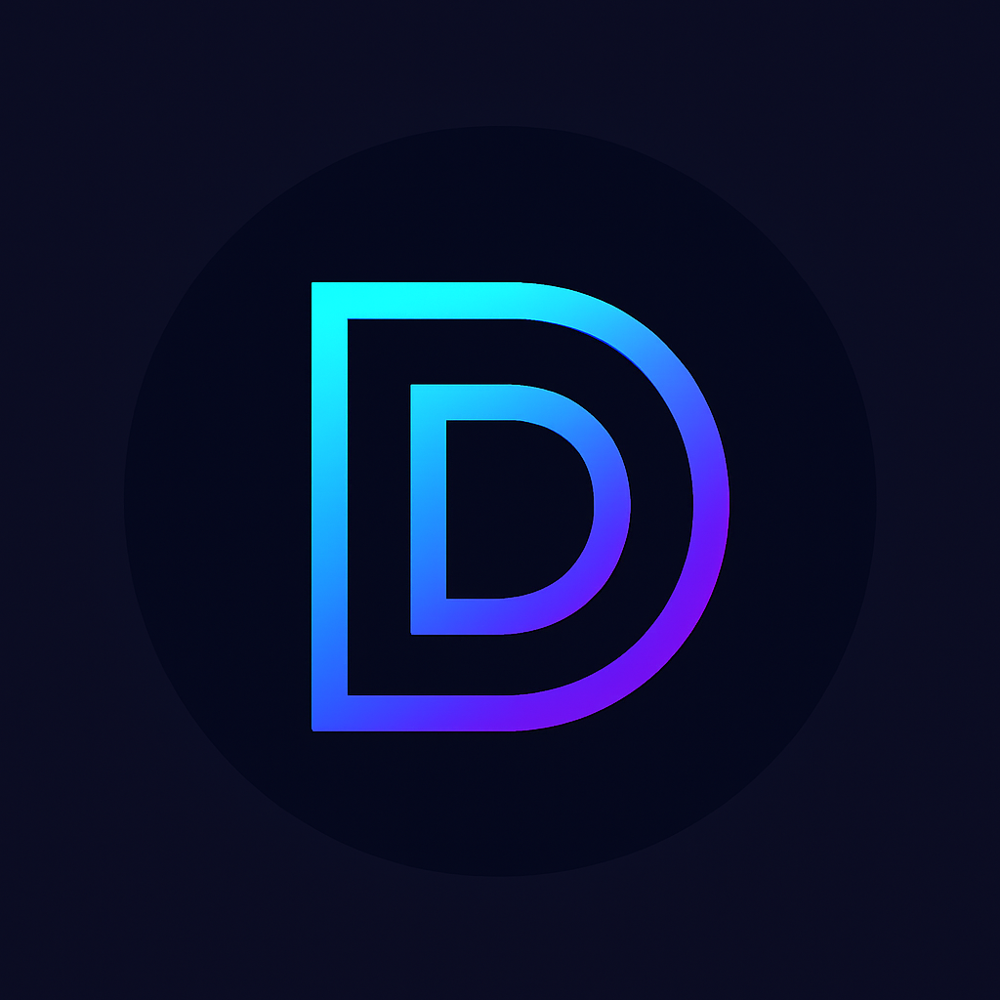
  
  [](https://reactjs.org/)
  [](https://tailwindcss.com/)
  [](https://www.framer.com/motion/)
  [](LICENSE)
  [](https://github.com/dhruvpatel16120/PortFolio-WebSite-v1)
</div>

<br>

<div align="center">
  <strong>A stunning, responsive portfolio website built with React, featuring modern design, smooth animations, and a comprehensive showcase of projects and skills.</strong>
</div>

<br>

<div align="center">
  
</div>

## 📋 Table of Contents

- [✨ Features](#-features)
- [🛠️ Technologies Used](#️-technologies-used)
- [📦 Installation](#-installation)
- [🚀 Getting Started](#-getting-started)
- [📱 Usage](#-usage)
- [🎨 Customization](#-customization)
- [📸 Screenshots & Previews](#-screenshots--previews)
- [📁 Project Structure](#-project-structure)
- [🔧 Configuration](#-configuration)
- [📤 Deployment](#-deployment)
- [🤝 Contributing](#-contributing)
- [📄 License](#-license)

## ✨ Features

### 🎯 Core Features
- **Responsive Design**: Fully responsive across all devices and screen sizes
- **Dark/Light Mode**: Toggle between dark and light themes with smooth transitions
- **Smooth Animations**: Powered by Framer Motion for engaging user experience
- **Modern UI/UX**: Clean, professional design with Tailwind CSS
- **SEO Optimized**: Meta tags, structured data, and performance optimized
- **Fast Loading**: Optimized images and lazy loading for better performance
- **Interactive Elements**: Hover effects, transitions, and micro-interactions

### 📄 Pages & Sections
- **Home**: Hero section with animated background and call-to-action
- **About**: Personal information, skills, and experience showcase
- **Projects**: Portfolio showcase with filtering and detailed project cards
- **Resume**: Professional experience, education, and skills timeline
- **Contact**: Contact form with validation and social media links
- **404 Page**: Custom error page with Lottie animation

### 🎨 Design Features
- **Gradient Backgrounds**: Beautiful animated gradients with smooth transitions
- **Glass Morphism**: Modern glass effect components with backdrop blur
- **Hover Effects**: Interactive hover animations and state changes
- **Icon Integration**: Comprehensive icon library with React Icons
- **Typography**: Professional font hierarchy and spacing
- **Color Schemes**: Custom light and dark mode color palettes

## 🛠️ Technologies Used

### Frontend Stack
- **React 19.1.0** - Modern React with latest features and hooks
- **React Router DOM 7.6.3** - Client-side routing with lazy loading
- **Framer Motion 12.23.6** - Advanced animation library
- **Tailwind CSS 3.4.11** - Utility-first CSS framework
- **React Icons 5.5.0** - Comprehensive icon library
- **Lottie React 2.4.1** - Lottie animations for 404 page
- **React Toastify 11.0.5** - Toast notifications system

### Development Tools
- **Create React App** - React development environment
- **PostCSS 8.5.6** - CSS processing and optimization
- **Autoprefixer 10.4.21** - CSS vendor prefixing

## 📦 Installation

### Prerequisites
- **Node.js** (version 16 or higher)
- **npm** or **yarn** package manager
- **Git** for version control

### Step 1: Clone the Repository
```bash
git clone https://github.com/dhruvpatel16120/PortFolio-WebSite-v1.git
cd PortFolio-WebSite-v1
```

### Step 2: Install Dependencies
```bash
npm install
# or
yarn install
```

### Step 3: Start Development Server
```bash
npm start
# or
yarn start
```

The application will open at `http://localhost:3000`

## 🚀 Getting Started

### Available Scripts

```bash
# Start development server
npm start

# Build for production
npm run build

# Run tests
npm test

# Eject from Create React App
npm run eject
```

### Environment Setup

1. **Development Mode**: The app runs in development mode with hot reload
2. **Production Build**: Use `npm run build` to create optimized production build
3. **Testing**: Run `npm test` to execute test suite

## 📱 Usage

### Navigation
- **Home**: Landing page with hero section and overview
- **About**: Personal information and skills showcase
- **Projects**: Portfolio showcase with filtering options
- **Resume**: Professional experience and education timeline
- **Contact**: Contact form and social media links

### Features Usage

#### Dark/Light Mode Toggle
- Click the sun/moon icon in the navigation bar
- Theme preference is saved in localStorage
- Smooth transitions between themes

#### Project Filtering
- Use filter buttons to view projects by category
- Categories: All Projects, Web Development, Full Stack, AI & ML, Mobile Apps
- Smooth animations during filtering

#### Contact Form
- Fill out the contact form with your details
- Form validation ensures all required fields are completed
- Toast notifications provide feedback
- Social media links for direct contact

## 🎨 Customization

### Personal Information
Update your personal information in the following files:

#### Home Page (`src/pages/Home.js`)
```javascript
// Update hero section content
const heroContent = {
  title: "Your Name",
  subtitle: "Your Title",
  description: "Your description"
};
```

#### About Page (`src/pages/About.js`)
```javascript
// Update personal information
const personalInfo = {
  name: "Your Name",
  title: "Your Title",
  bio: "Your bio",
  skills: ["Skill 1", "Skill 2", "Skill 3"]
};
```

#### Projects (`src/pages/Projects.js`)
```javascript
// Update projects array
const projects = [
  {
    id: 1,
    title: "Your Project",
    description: "Project description",
    image: "project-image-url",
    technologies: ["React", "Node.js"],
    github: "github-url",
    live: "live-url"
  }
];
```

### Styling Customization

#### Colors (`tailwind.config.js`)
```javascript
colors: {
  lightText: '#041125ff',
  darkText: '#ffffff',
  lightAccent: '#09154eff',
  darkAccent: '#ffffffff',
  lightBgFrom: '#71dbd4ff',
  lightBgVia: '#4c82e6ff',
  lightBgTo: '#5c5cf3ff',
  darkBgFrom: '#2b6b6b',
  darkBgVia: '#3d5a80',
  darkBgTo: '#3f3f83',
}
```

#### Animations (`src/pages/Home.js`)
```javascript
// Customize animation variants
const fadeInUp = {
  initial: { opacity: 0, y: 50 },
  animate: { opacity: 1, y: 0 },
  transition: { duration: 0.8 }
};
```

## 📸 Screenshots & Previews

### 🏠 Home Page
<div align="center">
  
  <p><em>Hero section with animated background and call-to-action buttons</em></p>
</div>

### 🌟 Light Mode Hero
<div align="center">
  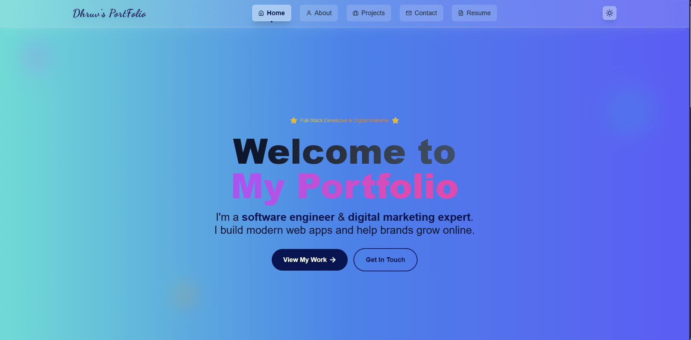
  <p><em>Light mode hero section with gradient backgrounds</em></p>
</div>

### 💼 Projects Section
<div align="center">
  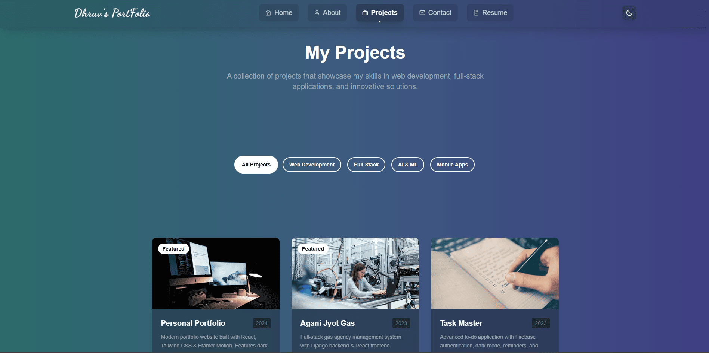
  <p><em>Projects showcase with filtering options</em></p>
</div>

### 🔍 Project Filtering
<div align="center">
  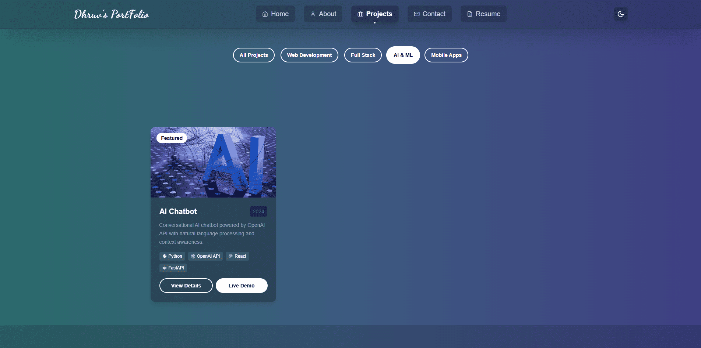
  <p><em>Interactive project filtering by category</em></p>
</div>

### 📋 Project Cards
<div align="center">
  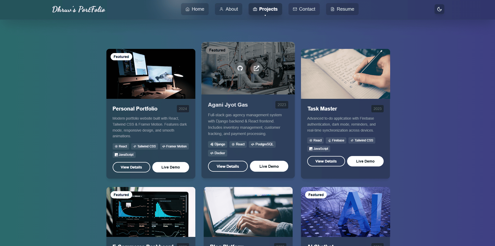
  <p><em>Detailed project cards with hover effects</em></p>
</div>

### 🎯 What I Do Section
<div align="center">
  
  <p><em>Services and expertise showcase</em></p>
</div>

### 🛠️ Technologies Used
<div align="center">
  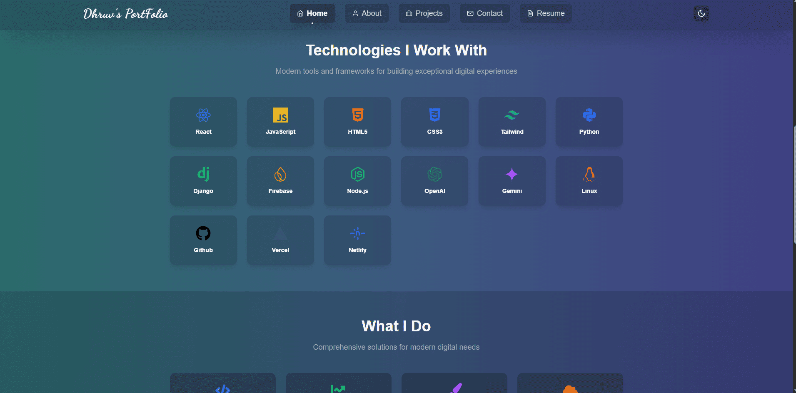
  <p><em>Technology stack and tools showcase</em></p>
</div>

### 👨‍💻 About Me
<div align="center">
  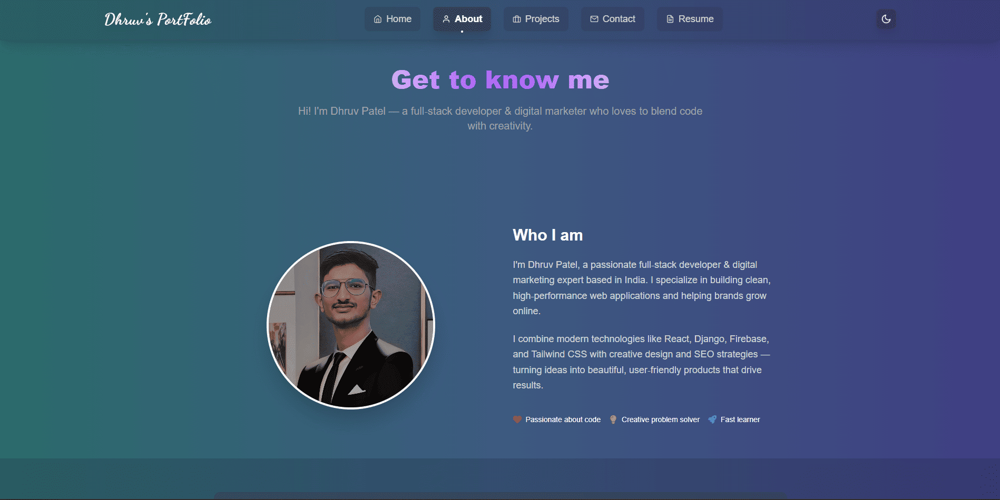
  <p><em>Personal information and background</em></p>
</div>

### 🎓 Skills Section
<div align="center">
  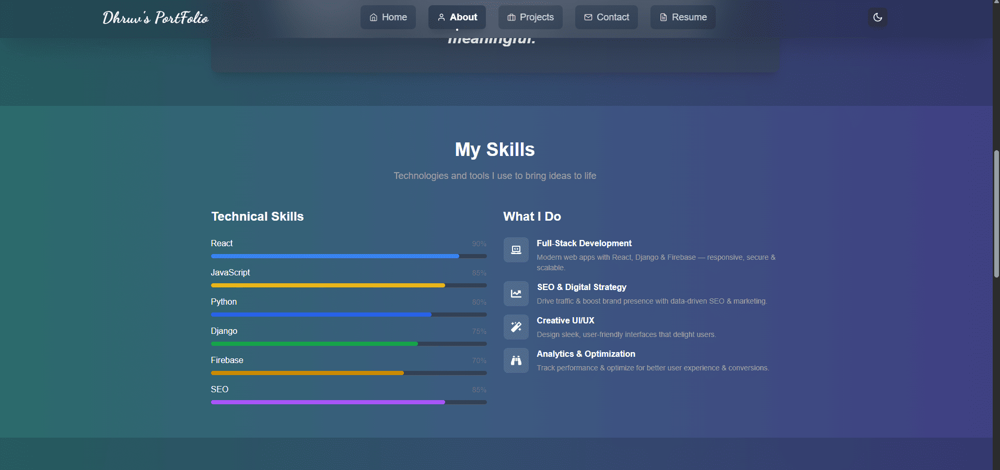
  <p><em>Technical skills and expertise</em></p>
</div>

### 📈 Experience Timeline
<div align="center">
  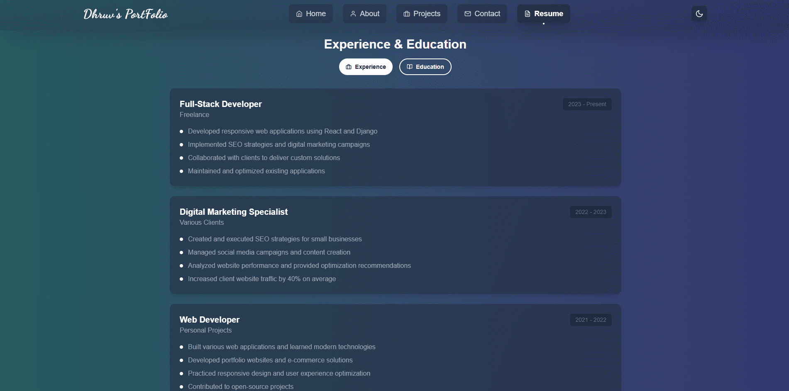
  <p><em>Professional experience timeline</em></p>
</div>

### 📊 Statistics
<div align="center">
  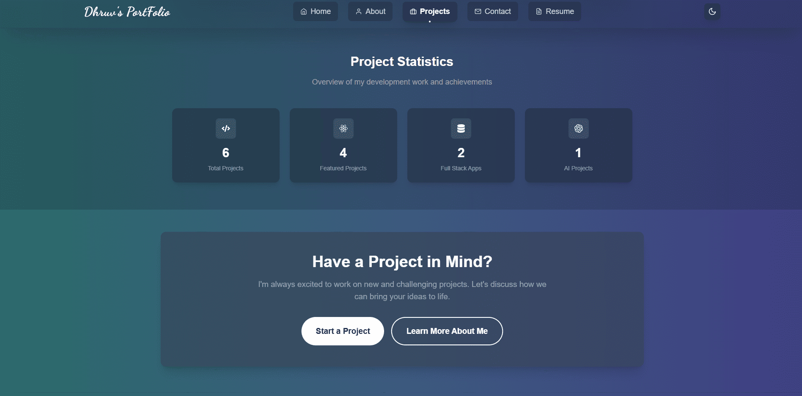
  <p><em>Project statistics and achievements</em></p>
</div>

### 📝 Resume Page
<div align="center">
  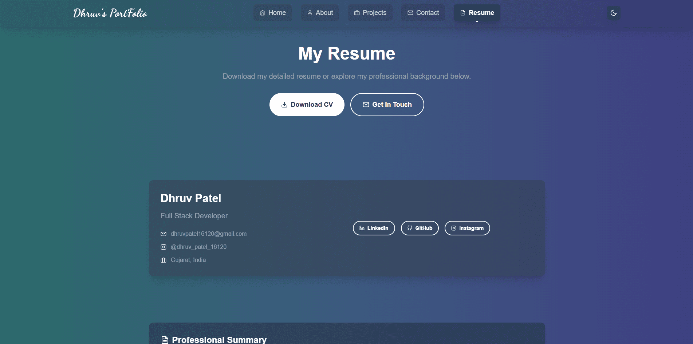
  <p><em>Professional resume and experience</em></p>
</div>

### 🏆 Certificates
<div align="center">
  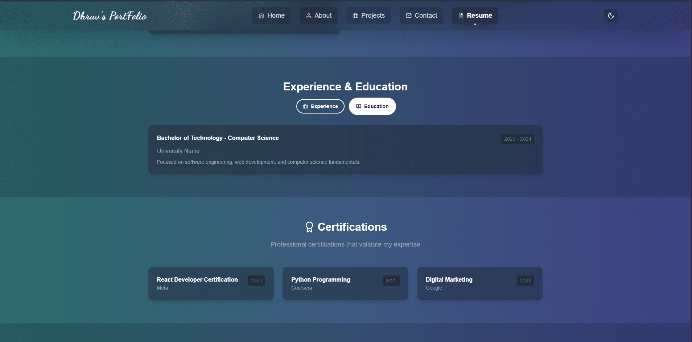
  <p><em>Professional certifications and achievements</em></p>
</div>

### 💬 Contact Form
<div align="center">
  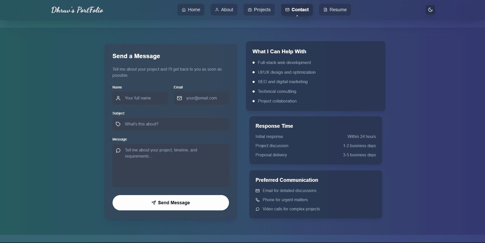
  <p><em>Contact form with validation</em></p>
</div>

### 📞 Get In Touch
<div align="center">
  
  <p><em>Contact information and social links</em></p>
</div>

## 📁 Project Structure

```
PortFolio-WebSite-v1/
├── public/
│   ├── index.html
│   ├── favicon.ico
│   ├── manifest.json
│   ├── logo.png
│   ├── dhruv.jpg
│   └── resume.pdf
├── preview/
│   ├── home.png
│   ├── hero_light.png
│   ├── projects.png
│   ├── project_filter.png
│   ├── project_card.png
│   ├── what_i_do.png
│   ├── tech_used.png
│   ├── about_me.png
│   ├── skills.png
│   ├── experience.png
│   ├── statistics.png
│   ├── resume.png
│   ├── certicifate.png
│   ├── send_message.png
│   └── get in touch.png
├── src/
│   ├── components/
│   │   ├── ui/
│   │   │   ├── Button.js
│   │   │   ├── Card.js
│   │   │   ├── Input.js
│   │   │   ├── LoadingSpinner.js
│   │   │   └── Textarea.js
│   │   ├── layout/
│   │   │   ├── Container.js
│   │   │   ├── PageLayout.js
│   │   │   └── Section.js
│   │   ├── error/
│   │   │   └── ErrorBoundary.js
│   │   ├── seo/
│   │   │   └── SEOHead.js
│   │   ├── Footer.js
│   │   ├── Layout.js
│   │   └── Navbar.js
│   ├── context/
│   │   └── ThemeContext.js
│   ├── pages/
│   │   ├── About.js
│   │   ├── Contact.js
│   │   ├── Home.js
│   │   ├── NotFound.js
│   │   ├── Projects.js
│   │   └── Resume.js
│   ├── assets/
│   │   ├── 404-animation.json
│   │   └── youtube.png
│   ├── App.js
│   ├── index.js
│   └── index.css
├── package.json
├── tailwind.config.js
├── postcss.config.js
└── README.md
```

## 🔧 Configuration

### Tailwind CSS Configuration
The project uses Tailwind CSS with custom configuration:

```javascript
// tailwind.config.js
module.exports = {
  darkMode: 'class',
  content: ["./src/**/*.{js,jsx,ts,tsx}"],
  theme: {
    extend: {
      colors: {
        // Custom color palette
        lightText: '#041125ff',
        darkText: '#ffffff',
        lightAccent: '#09154eff',
        darkAccent: '#ffffffff',
        lightBgFrom: '#71dbd4ff',
        lightBgVia: '#4c82e6ff',
        lightBgTo: '#5c5cf3ff',
        darkBgFrom: '#2b6b6b',
        darkBgVia: '#3d5a80',
        darkBgTo: '#3f3f83',
      },
      animation: {
        'gradient-x': 'gradientX 2s ease infinite',
        'gradient-y': 'gradientY 2s ease infinite',
        'gradient-xy': 'gradientXY 2s ease infinite',
      }
    }
  }
}
```

### PostCSS Configuration
```javascript
// postcss.config.js
module.exports = {
  plugins: {
    tailwindcss: {},
    autoprefixer: {},
  },
}
```

### ESLint Configuration
```json
{
  "extends": [
    "react-app",
    "react-app/jest"
  ]
}
```

## 📤 Deployment

### Netlify Deployment
1. **Connect Repository**: Link your GitHub repository to Netlify
2. **Build Settings**:
   - Build command: `npm run build`
   - Publish directory: `build`
3. **Environment Variables**: Add any required environment variables
4. **Deploy**: Netlify will automatically deploy on push to main branch

### Vercel Deployment
1. **Import Project**: Import your GitHub repository to Vercel
2. **Framework Preset**: Select "Create React App"
3. **Build Settings**: Vercel will auto-detect settings
4. **Deploy**: Click deploy and Vercel will build and deploy

### GitHub Pages Deployment
1. **Install gh-pages**: `npm install --save-dev gh-pages`
2. **Add Scripts** to package.json:
   ```json
   {
     "scripts": {
       "predeploy": "npm run build",
       "deploy": "gh-pages -d build"
     }
   }
   ```
3. **Deploy**: Run `npm run deploy`

## 🤝 Contributing

We welcome contributions! Please follow these steps:

1. **Fork** the repository
2. **Create** a feature branch (`git checkout -b feature/AmazingFeature`)
3. **Commit** your changes (`git commit -m 'Add some AmazingFeature'`)
4. **Push** to the branch (`git push origin feature/AmazingFeature`)
5. **Open** a Pull Request

### Contribution Guidelines
- Follow the existing code style
- Add comments for complex logic
- Update documentation as needed
- Test your changes thoroughly
- Ensure responsive design works on all devices

## 📄 License

This project is licensed under the MIT License - see the [LICENSE](LICENSE) file for details.

## 🙏 Acknowledgments

- **React Team** for the amazing framework
- **Tailwind CSS** for the utility-first CSS framework
- **Framer Motion** for smooth animations
- **React Icons** for the comprehensive icon library
- **Unsplash** for beautiful stock photos

## 📞 Contact

<div align="center">

**Dhruv Patel** - Full Stack Developer & Digital Marketing Expert

[](https://github.com/dhruvpatel16120)
[](https://linkedin.com/in/dhruvpatel16120)
[](https://dhruvpatelportfolio.vercel.app/)

**Email**: dhruvpatel16120@gmail.com  
**Portfolio**: [dhruvpatelportfolio.vercel.app/](https://dhruvpatelportfolio.vercel.app/)

</div>

---

<div align="center">

⭐ **Star this repository if you found it helpful!**

Made with ❤️ by **Dhruv Patel**

[](https://github.com/dhruvpatel16120/PortFolio-WebSite-v1)
[](https://github.com/dhruvpatel16120/PortFolio-WebSite-v1)
[](https://github.com/dhruvpatel16120/PortFolio-WebSite-v1/issues)

</div>
