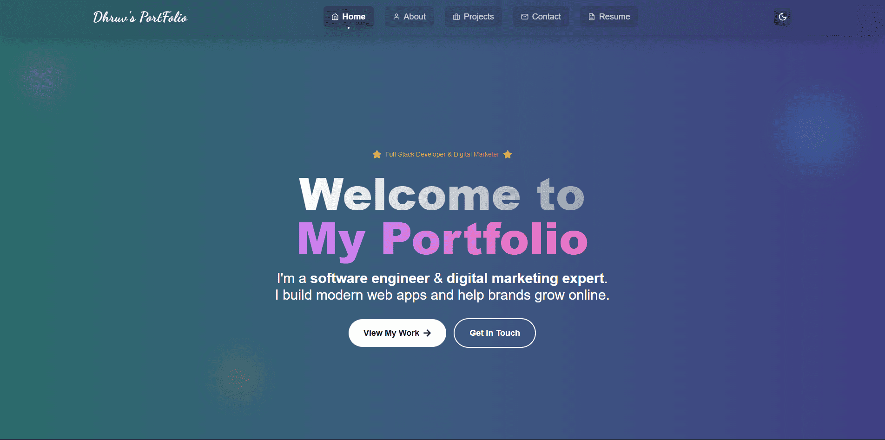

# 🚀 Portfolio Website v1.0

A modern, responsive portfolio website built with React, featuring a comprehensive admin panel for content management. This project showcases full-stack development skills with Firebase backend, Cloudinary media management, and advanced analytics.



## ✨ Features

### 🌐 Public Website
- **Responsive Design**: Mobile-first approach with Tailwind CSS
- **Dark/Light Theme**: Automatic theme switching with system preference detection
- **Smooth Animations**: Framer Motion powered animations and transitions
- **SEO Optimized**: Meta tags, structured data, and performance optimization
- **Contact Form**: Integrated contact system with email notifications
- **Project Showcase**: Dynamic project gallery with filtering and search
- **Resume Download**: PDF resume with professional formatting
- **Analytics Tracking**: User behavior and page view analytics

### 🔧 Admin Panel
- **Secure Authentication**: Firebase Auth with role-based access control
- **Content Management**: Dynamic content editing for all website sections
- **Media Management**: Cloudinary integration for image/file uploads
- **Contact Management**: View and respond to contact form submissions
- **Analytics Dashboard**: Comprehensive website analytics and insights
- **Settings Management**: Site configuration and security settings
- **User Management**: Admin user creation and permission management

### 🛡️ Security Features
- **Rate Limiting**: Login attempt protection (5 attempts, 15min lockout)
- **Session Management**: Secure session handling with timeout
- **Input Validation**: Comprehensive form validation and sanitization
- **Error Handling**: Graceful error handling with user-friendly messages
- **Firebase Security Rules**: Proper Firestore security configuration

## 🛠️ Tech Stack

### Frontend
- **React 18** - Modern React with hooks and context
- **React Router v6** - Client-side routing
- **Tailwind CSS** - Utility-first CSS framework
- **Framer Motion** - Animation library
- **React Icons** - Icon library
- **React Toastify** - Notification system

### Backend & Services
- **Firebase Authentication** - User authentication and management
- **Firestore** - NoSQL database for content and user data
- **Cloudinary** - Cloud media management and optimization
- **Firebase Hosting** - Static site hosting

### Development Tools
- **Create React App** - React development environment
- **PostCSS** - CSS processing
- **ESLint** - Code linting
- **Jest** - Testing framework

## 📁 Project Structure

```
PortFolio-WebSite/
├── public/                 # Static assets
├── src/
│   ├── admin/             # Admin panel components
│   │   ├── components/    # Admin UI components
│   │   ├── pages/         # Admin page components
│   │   ├── services/      # Admin services
│   │   └── utils/         # Admin utilities
│   ├── components/        # Shared UI components
│   ├── context/           # React context providers
│   ├── firebase/          # Firebase configuration
│   ├── hooks/             # Custom React hooks
│   ├── pages/             # Public website pages
│   ├── services/          # API and external services
│   └── assets/            # Static assets
├── scripts/               # Setup and utility scripts
└── preview/               # Website preview images

```

## 🚀 Quick Start

### Prerequisites
- Node.js (v16 or higher)
- npm or yarn
- Firebase account
- Cloudinary account (optional)

### Installation

1. **Clone the repository**
   ```bash
   git clone https://github.com/dhruvpatel16120/PortFolio-WebSite.git
   cd PortFolio-WebSite
   ```

2. **Install dependencies**
   ```bash
   npm install
   ```

3. **Set up environment variables**
   ```bash
   cp env-template.txt .env
   ```
   
   Fill in your Firebase and Cloudinary credentials in the `.env` file.

4. **Set up Firebase**
   ```bash
   npm run setup-firebase
   ```

5. **Set up Cloudinary (optional)**
   ```bash
   npm run setup-cloudinary
   ```

6. **Create admin user**
   ```bash
   npm run create-admin
   ```

7. **Start development server**
   ```bash
   npm start
   ```

The website will be available at `http://localhost:3000`
Admin panel will be available at `http://localhost:3000/admin`

## 🔧 Configuration

### Environment Variables

Create a `.env` file in the root directory with the following variables:

```env
# Firebase Configuration
REACT_APP_FIREBASE_API_KEY=your_api_key_here
REACT_APP_FIREBASE_AUTH_DOMAIN=your_project_id.firebaseapp.com
REACT_APP_FIREBASE_PROJECT_ID=your_project_id
REACT_APP_FIREBASE_STORAGE_BUCKET=your_project_id.appspot.com
REACT_APP_FIREBASE_MESSAGING_SENDER_ID=your_messaging_sender_id
REACT_APP_FIREBASE_APP_ID=your_app_id

# Admin Configuration
REACT_APP_ADMIN_EMAIL=admin@yourdomain.com
REACT_APP_ADMIN_PASSWORD=YourSecurePassword123!
REACT_APP_ADMIN_ROLE=super_admin

# Cloudinary Configuration (Optional)
REACT_APP_CLOUDINARY_CLOUD_NAME=your_cloudinary_cloud_name
REACT_APP_CLOUDINARY_UPLOAD_PRESET=portfolio_uploads
REACT_APP_CLOUDINARY_API_KEY=your_cloudinary_api_key
REACT_APP_CLOUDINARY_API_SECRET=your_cloudinary_api_secret
```

### Firebase Setup

1. Create a new Firebase project
2. Enable Authentication (Email/Password)
3. Create a Firestore database
4. Set up Firebase Hosting
5. Configure Firestore security rules

### Cloudinary Setup

1. Create a Cloudinary account
2. Create an upload preset
3. Configure CORS settings
4. Set up folder structure

## 📱 Pages & Features

### Public Website

- **Home** (`/`) - Hero section, services, and call-to-action
- **About** (`/about`) - Personal information and skills
- **Projects** (`/projects`) - Portfolio showcase with filtering
- **Contact** (`/contact`) - Contact form with validation
- **Resume** (`/resume`) - Professional resume with download
- **404** - Custom error page

### Admin Panel

- **Dashboard** (`/admin`) - Overview and quick actions
- **Content Management** (`/admin/content`) - Edit website content
- **Contact Management** (`/admin/contact`) - View and respond to submissions
- **Media Management** (`/admin/media`) - Upload and manage media files
- **Analytics** (`/admin/analytics`) - Website analytics and insights
- **Settings** (`/admin/settings`) - Site configuration and security

## 🎨 Customization

### Styling
The project uses Tailwind CSS for styling. You can customize:
- Colors in `tailwind.config.js`
- Theme variables in `src/index.css`
- Component styles in individual component files

### Content
All content is managed through the admin panel or can be edited in:
- `src/pages/` - Page content and structure
- `src/components/` - Reusable components
- `public/` - Static assets

### Features
- Add new pages in `src/pages/`
- Create new components in `src/components/`
- Extend admin functionality in `src/admin/`

## 🔒 Security

### Authentication
- Firebase Authentication with email/password
- Role-based access control
- Session management with timeout
- Rate limiting for login attempts

### Data Protection
- Input validation and sanitization
- Secure API endpoints
- Environment variable protection
- Firebase security rules

### Best Practices
- HTTPS enforcement
- Content Security Policy
- XSS protection
- CSRF protection

## 📊 Analytics

The website includes comprehensive analytics:
- Page view tracking
- User behavior analysis
- Contact form analytics
- Performance metrics
- Error tracking

## 🚀 Deployment

### Firebase Hosting
```bash
npm run build
firebase deploy
```

### Other Platforms
The project can be deployed to:
- Vercel
- Netlify
- GitHub Pages
- Any static hosting service

## 🤝 Contributing

1. Fork the repository
2. Create a feature branch (`git checkout -b feature/amazing-feature`)
3. Commit your changes (`git commit -m 'Add amazing feature'`)
4. Push to the branch (`git push origin feature/amazing-feature`)
5. Open a Pull Request

## 📝 License

This project is licensed under the MIT License - see the [LICENSE](LICENSE) file for details.

## 🙏 Acknowledgments

- [React](https://reactjs.org/) - Frontend framework
- [Firebase](https://firebase.google.com/) - Backend services
- [Tailwind CSS](https://tailwindcss.com/) - CSS framework
- [Framer Motion](https://www.framer.com/motion/) - Animation library
- [Cloudinary](https://cloudinary.com/) - Media management

## 📞 Support

For support and questions:
- Create an issue on GitHub
- Contact through the website contact form
- Email: [dhruvpatel16120@gmail.com]

---

**Built with ❤️ by Dhruv Patel**

*Full-Stack Developer & Digital Marketing Expert*
